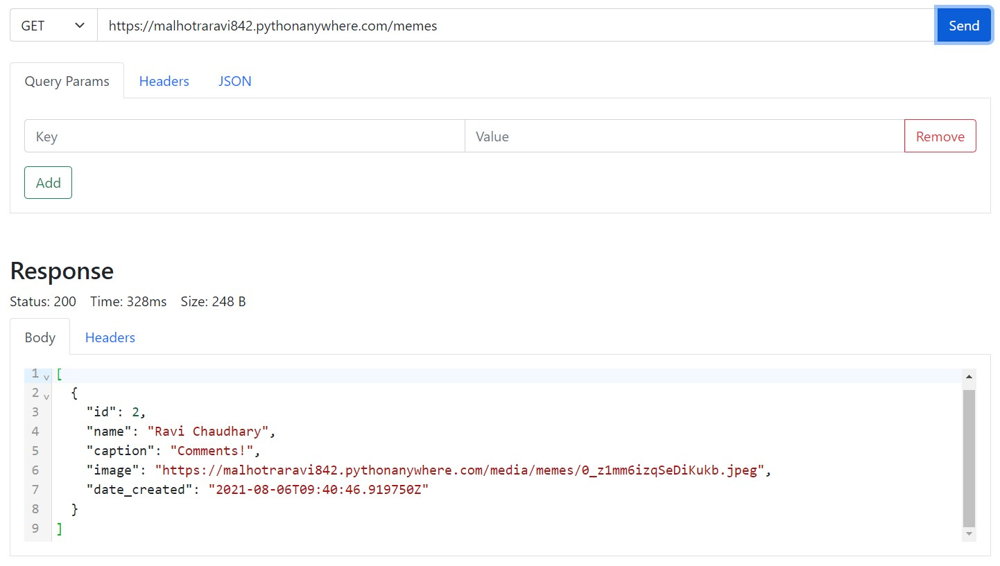

# postman_clone

A clone of the tool called Postman, which will help us to make all type of request to any REST API.



## Tech Stack Used

- Backend :- Node.js
- Frontend :- Bootstrap, HTML

## Installation on Local Machine

Use the package manager [npm](https://www.npmjs.com/) to setup this project.

```bash
npm install

npm start

```
